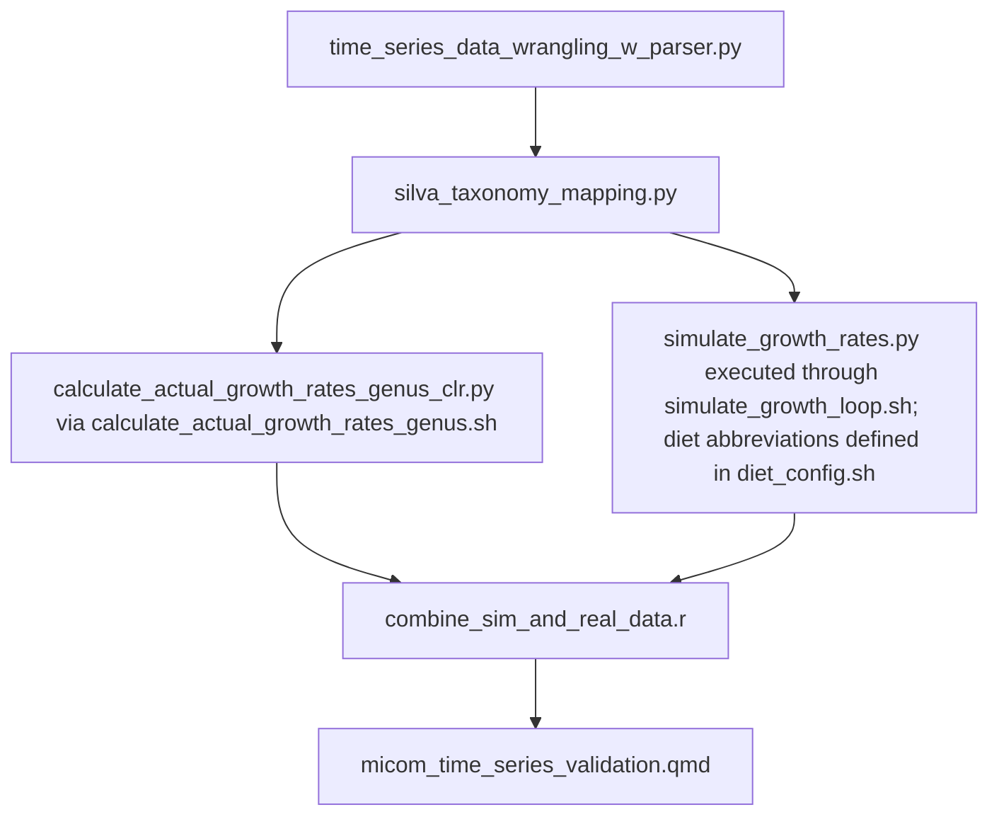

# micom-time-series
using time series data to test micom's ability to predict growth 

# Workflow


# Scripts 

## 1) `scripts/time_series_data_wrangling.py`
- This script processes OTU tables and metadata for microbiome analysis by:
1. Filtering OTU data and metadata for specific subjects (anonymized names).
2. Averaging microbial abundances for each OTU across samples if mulpiple samples are present for a single day.
3. Identifying missing daily timepoints and interpolating OTU abundance by Piecewise Cubic Hermite Interpolating Polynomial (PCHIP).
4. Combining interpolated time points with real/averaged daily timepoints and preparing them for QIIME2.
5. Updating metadata to include interpolated samples by generating sample IDs and data types ("Real" or "Interpolated").


**Example of use with argparser**: 
- additional information on the development and use of this script can be found in `./notebooks/time_series_wrangling.ipynb`
- What each argument does 
  1.	-n or --input_biom_path: Path to the input BIOM file.
  2.	-m or --metadata_path: Path to the metadata file.
  3.	-i or --output_dir: Directory where intermediate files (e.g., interpolated OTU tables) will be saved.
  4.	-o or --final_output_dir: Directory where final combined outputs will be saved.
  5.	-l or --subject_ids: List of subject IDs to process.
```
%run ../scripts/time_series_data_wrangling_w_parser.py \
  -i "../data/bangladesh_caseu_otu_corrected_format.biom" \
  -m "../data/metadata_full_w_times.csv" \
  -n "../data/interpolated_bioms/" \
  -o "../data/combined_meta_and_otu_outputs/" \
  -l F01 M01 M02
```  

**Inputs**:  
- OTU table in BIOM format (`./data/bangladesh_caseu_otu_corrected_format.biom`)
- Metadata file (`./data/metadata_full_w_times.csv`)
- List of subject IDs to process

**Outputs**:
- Combined OTU tables for QIIME2 in `.tsv` format.
- Updated metadata files with real and interpolated sample entries labeled accordingly.


## 2) `scripts/silva_taxonomy_mapping.py`
**Purpose**:
This script processes subject-specific OTU tables and maps OTUs to taxonomy using QIIME2 and the SILVA database.
The workflow includes converting OTU tables to QIIME2-compatible formats, performing taxonomy classification,
and exporting results for downstream analysis.

**Workflow**:
1. Convert OTU tables (TSV) to BIOM format.
2. Import BIOM files into QIIME2 as FeatureTable artifacts.
3. Classify OTUs using the SILVA Naive Bayes taxonomy classifier.
4. Export taxonomy classifications to TSV format.

**Inputs**:
- OTU tables in TSV format, with sample IDs as headers and OTU IDs as rows.
- Representative sequences file (QIIME2 `.qza` artifact).
- SILVA taxonomy classifier (`.qza` artifact).

**Outputs**:
For each OTU table, the script generates:
- `<subject_id>_combined_otu.biom`: BIOM-formatted OTU table.
- `<subject_id>_feature_table.qza`: QIIME2 FeatureTable artifact.
- `<subject_id>_taxonomy.qza`: QIIME2 Taxonomy artifact.
- `<subject_id>_taxonomy.tsv`: Exported taxonomy in TSV format.

**Arguments**:
- `-i, --otu_table_dir`: Directory containing subject-specific OTU tables (e.g., *_combined_otu_qiime2.tsv).
- `-r, --rep_seq_path`: Path to the QIIME2 artifact for representative sequences (e.g., .qza file).
- `-c, --classifier_path`: Path to the SILVA classifier artifact (e.g., silva-138-99-nb-classifier.qza).
- `-o, --output_dir`: Directory to store QIIME2 outputs (feature tables, taxonomy, TSV exports).

**Example**:
```
    python silva_taxonomy_mapping.py \
        -i ../data/combined_meta_and_otu_outputs/ \
        -r ../data/uclust_casey_rep_set.qza \
        -c ../data/silva-138-99-nb-classifier.qza \
        -o ../data/qiime_outputs/
```

**Notes**:
- Ensure the QIIME2 environment is activated before running the script (the QIIME2 env versions I used can be found in the `./envs` folder.
- Input files must align with the requirements for QIIME2 taxonomy classification.
- Example run can be found in `notebooks/time_series_qiime_silva.ipynb`


## 3) `scripts/calculate_actual_growth_rates_genus_clr.py`
**Purpose**:
This script calculates the change in CLR-transformed OTU relative abundance values
 between consecutive samples from QIIME2 feature tables (`feature_table.qza`) 
 for multiple subjects. Each subject's data is processed independently, 
 and the results are saved separately.

**Workflow**:
1. Export the feature table for each subject from QIIME2 (`.qza`) to `.biom` format.
2. Convert the `.biom` file to a readable `.tsv` format.
3. Load the `.tsv` into a pandas DataFrame and sort columns (samples) by epoch time.
4. Perform centered log ratio transformations to relative abundance data.
5. Collapse OTUs at the genus level.
4. Calculate the change in abundance (ΔAbundance) for each CLR-transformed 
genus relative abundance between consecutive days.
6. Save the resulting growth rates as a `.csv` file for each subject.

**Inputs**:
- A directory of QIIME2 feature tables (`feature_table.qza`) for multiple subjects.
- A `taxonomy.qza` of the feature_table samples mapped by Silva
- Sample IDs (column headers) as Unix epoch time values in seconds.

**Outputs**:
- One `<subject_id>_actual_growth_rates.csv` file per subject:
  - Rows = genus IDs.
  - Columns = Epoch time of the first day in consecutive days.
  - Values = Change in abundance (ΔCLR-transformedRelativeAbundance).
 
**Example**:  
- Executable via bash
- Example below can be found at `scripts/calculate_actual_growth_rates_genus_clr.sh`
```
python3 ./calculate_actual_growth_rates_genus_clr.py \
    --feature_tables_dir ../data/qiime_outputs/ \
    --taxonomy_dir ../data/qiime_outputs \
    --output_dir ../data/actual_growth_rates_genus_clr/
```

## 4) `scripts/simulate_growth_rates.py`

**Purpose**:

This script builds subject-specific MICOM community metabolic models from QIIME2-derived taxonomic profiles and simulates microbial growth under a specified diet and cooperative tradeoff value. It serves as the core MICOM modeling step in the workflow.

**Workflow**:

1. Load subject-specific taxonomic abundance data.
2. Load a diet medium (`.qza`) exported from QIIME2.
3. Build subject-specific GSMMs using MICOM's `build()` function.
4. Export AGORA mapping files and manifest summaries.
5. Complete the diet medium using `complete_community_medium()`.
6. Save metabolites added during medium completion.
7. Simulate growth using the specified solver and tradeoff value.
8. Save and extract growth results.

**Inputs**:

* Subject-specific QIIME2 outputs (`feature_table.qza` and taxonomy assignments).
* AGORA model database (`.qza`).
* Diet medium (`.qza`).
* MICOM parameters:

  * solver
  * tradeoff value
  * thread count

**Outputs**:

For each simulation run:

* Pickled community metabolic models:

  * `pickled_<subject>_*`
* AGORA taxonomy mapping files.
* Manifest summary files describing model coverage.
* Added metabolite report:

  * `added_metabolites_<subject>_<model>_<diet>.csv`
* MICOM growth results:

  * `growth_<subject>_<parameters>.zip`
* Extracted MICOM growth folder:

  * `growth_<subject>_<parameters>/`

**Arguments**:

| Argument                | Description                                          |
| ----------------------- | ---------------------------------------------------- |
| `--subject_id`          | Subject ID to process                                |
| `--qza_dir`             | Directory containing QIIME2 outputs                  |
| `--model_dir`           | Directory containing AGORA model databases           |
| `--model_name`          | AGORA model database file                            |
| `--pickled_gsmm_out`    | Output directory for pickled GSMMs                   |
| `--solver`              | Optimization solver (e.g. `osqp`, `gurobi`, `cplex`) |
| `--threads`             | Number of CPU threads                                |
| `--diet_fp`             | Diet medium `.qza` file                              |
| `--tradeoff`            | MICOM cooperative tradeoff value (0–1)               |
| `--growth_out_fp`       | Output path for MICOM growth results                 |
| `--added_metab_out_dir` | Directory for added metabolite reports               |

**Example**:

Example execution can be found in `scripts/simulate_growth_rates.sh`.

```bash
python3 simulate_growth_rates.py \
    --subject_id M01 \
    --model_name agora201_refseq216_genus_1.qza \
    --pickled_gsmm_out ../data/pickled_models/pickled_M01_agora201_gurobi_20260112 \
    --solver osqp \
    --threads 10 \
    --diet_fp ../data/diets/western_diet_gut_agora.qza \
    --tradeoff 0.8 \
    --growth_out_fp ../data/growth_rates/growth_M01_agora201_gurobi_wd_08_20260112.zip \
    --added_metab_out_dir ../data/added_metabolites/added_metabs_M01_agora201_gurobi_wd_08_20260112
```

### Parameter Sweeps with `simulate_growth_loop.sh`
Most analyses in this project are performed using `simulate_growth_loop.sh`, which automates repeated execution of `simulate_growth_rates.py` across many combinations of experimental parameters.
The script:
1. Loads diet abbreviations from `diet_config.sh`.
2. Iterates through:
   * one or more subjects,
   * multiple diet formulations,
   * multiple MICOM cooperative tradeoff values.
3. Dynamically generates output filenames encoding parameter values.
4. Executes `simulate_growth_rates.py` for every parameter combination.
This allows systematic benchmarking of MICOM predictions across different ecological assumptions and nutrient environments.
The example configuration shown in `simulate_growth_loop.sh` performs:

```text
1 subject × 4 diets × 10 tradeoff values = 40 MICOM simulations
```
Each simulation produces its own growth results and metabolite-completion report, enabling downstream comparison of how diet and tradeoff influence predictive performance.

**Related files**:

* `simulate_growth_rates.sh` — example execution of a single MICOM simulation.
* `simulate_growth_loop.sh` — performs parameter sweeps across diets and tradeoff values.
* `diet_config.sh` — defines shorthand names used in output filenames.


## 5) scripts/combine_sim_and_real_data.r
**Purpose**: 
This script allows for the outputs of simulate_growth_rates.py (from simulate_growth_loop.sh) 
and calculate_actual_growth_rates_genus_clr.py to be combined into one long format dataframe 
for downstream comparative analyses.

**Workflow**:
1. Read in all actual growth rate files and convert fron wide to long-format
2. Read in all simulated growth rate files and add columns for each micom parameter 
(e.g. micom step, subject, model database, optimization solver, diet, tradeoff value)
3. (OPTIONAL) filter for prevalent taxa 
4. Combine actual and simulated data into one dataframe
5. (OPTIONAL) Add additional metadata columns for later filtering or comparison
6. Save long-format combined df as .csv (`combined_sim_real_data.csv`)

**Inputs**: 
- A list of subject_ids
- corresponding `<subject_id>_actual_growth_rates.csv` file 
(calculate_actual_growth_rates_genus_clr.py output)
- path to "growth_rates" folder output by `simulate_growth_rates.py` 
(must contain .zip and unzipped growth_rates folder for each unique parameter set tested)

**Output**: 
- `combined_sim_real_data.csv`: a long-format dataframe where each row is a single genus within 
a single timepoint of one parameter combination, and columns include MICOM-predicted growth rates, 
metabolites, and reactions; abundance and actual change in abundance between this and the 
next sequential timepoint; and identifiers of each different parameter for filtering and comparison


# Flowchart

