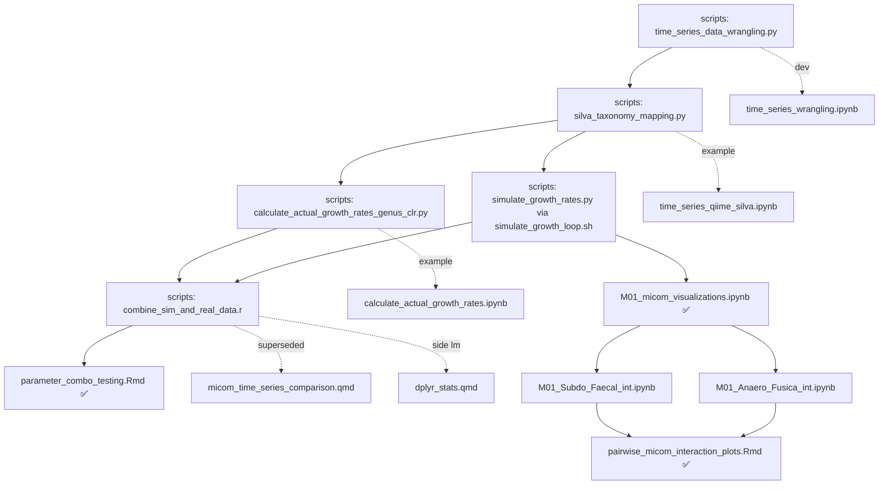

# `notebooks/`

Exploratory development notebooks and downstream R/Quarto analysis for the
**micom-time-series** project.

The upstream command-line pipeline (steps 1–5) is documented in the top-level
`README.md` / `scripts/` folder. This folder picks up where those scripts leave
off and falls into four groups:

- **A — Upstream dev/example notebooks** that accompany `scripts/` steps 1–3.
- **B — Downstream sim-vs-real comparison & parameter-ranking analysis** (consumes
  `combine_sim_and_real_data.r` output, step 5).
- **C — Per-genus focal-interaction / metabolite-exchange figures for subject M01.**
- **D — Side-thread** (AGORA2 hypergraph exploration; not part of the growth-prediction
  pipeline).

**Status legend:**
✅ canonical (trust this one)  🟡 superseded / partial — kept for reference
🔴 does not run as-is  🧪 side-thread (separate direction that Laurie and Casey didn't get around to)

---

## At a glance

| File | Group | Purpose | Status |
| --- | --- | --- | --- |
| `time_series_wrangling.ipynb` | A | Dev notebook for step 1 (`time_series_data_wrangling.py`) | ✅ |
| `time_series_qiime_silva.ipynb` | A | Example run of step 2 (`silva_taxonomy_mapping.py`) | ✅ |
| `calculate_actual_growth_rates.ipynb` | A | Example runs for the step-3 actual-growth-rate scripts | ✅ |
| `parameter_combo_testing.Rmd` | B | **Canonical** Spearman parameter-ranking analysis | ✅ |
| `micom_time_series_comparison.qmd` | B | Multi-subject draft; only home of the inline data-assembly loop | 🟡 |
| `micom_time_series_validation.qmd` | B | Earliest F01-only draft (the node the old flowchart points to) | 🟡🔴 |
| `parameter_combo_testing_broken.qmd` | B | Early `.qmd` of the ranking analysis; breaks on a stale grouping | 🔴 |
| `dplyr_stats.qmd` | B | Small standalone `lm`/ANOVA side-look on the combined CSV | 🟡 |
| `M01_micom_visualizations.ipynb` | C | Hub: growth, exchanges, focal interactions, SCFA producers | ✅ |
| `M01_Subdo_Faecal_int.ipynb` | C | Compute focal interactions: Subdoligranulum × Faecalibacterium | ✅ |
| `M01_Anaero_Fusica_int.ipynb` | C | Compute focal interactions: Anaerostipes × Fusicatenibacter | 🟡 |
| `pairwise_micom_interaction_plots.Rmd` | C | **Canonical** interaction figure script (saves PNGs) | ✅ |
| `M01_Anaerostipes_Focal_Interactions.Rmd` | C | Earlier Anaerostipes interaction plots | 🟡 |
| `20251029_jsonbs.ipynb` | D | AGORA2 JSON → reaction hypergraph exploration | 🧪 |

---

## A — Upstream dev / example notebooks

These are the working notebooks behind `scripts/` steps 1–3. They are kept as the
"how it was developed / how to run it" companions referenced by the top-level README.
There is **no notebook for step 4** (`simulate_growth_rates.py` / `simulate_growth_loop.sh`,
run from the shell) or **step 5** (`combine_sim_and_real_data.r`, an R script).

### 1) `time_series_wrangling.ipynb` ✅
Development notebook for **step 1** (`time_series_data_wrangling.py`). Loads the raw
BIOM table into pandas, combines OTU tables per subject, handles PCHIP interpolation of
missing daily timepoints, and prepares the combined OTU/metadata tables for QIIME2.
Ends with the argparse-wrapped script invocation.
- **Subjects:** F01, M01, M02.

### 2) `time_series_qiime_silva.ipynb` ✅
Example run of **step 2** (`silva_taxonomy_mapping.py`): TSV → BIOM → QIIME2
`FeatureTable`, SILVA Naïve-Bayes classification, taxonomy export to TSV. Contains both
the manual cell-by-cell version and the final wrapped-script invocation.

### 3) `calculate_actual_growth_rates.ipynb` ✅
Example/scratch runs for the **step-3** family of actual-growth-rate scripts
(`calculate_actual_growth_rates.py`, `…_genus.py`). The pipeline's canonical script is
`calculate_actual_growth_rates_genus_clr.py`; this notebook predates/accompanies that final
CLR + genus-collapsed version and is useful as the dev record.

---

## B — Sim-vs-real comparison & parameter ranking

All four R/Quarto files here are iterations of the **same analysis**: correlate
MICOM-predicted growth rates against actual CLR abundance changes, then rank MICOM
parameter combinations (model DB × diet × tradeoff) by predictive accuracy. They are
listed oldest → newest.

**Data dependency:** the canonical version reads `../data/combined_sim_real_data.csv`
(produced by **step 5**, `combine_sim_and_real_data.r`). The two `…time_series_…qmd`
drafts instead rebuild that table inline from the `growth_*.zip` outputs.

### `parameter_combo_testing.Rmd` ✅ — **use this one**
The most complete and current version of the analysis (dated 2025-03-26).
- Reads the pre-built `combined_sim_real_data.csv`.
- Runs Spearman correlations per `(folder_name × taxon × subject × params)` via
  `group_by` + `nest` + `broom::tidy`, filtering zero-variance groups.
- Builds a performance summary (significant positive/negative taxa, `pos_minus_neg`,
  median rho) and the stacked positive / negative / non-significant bar plots ranking the
  top parameter combos per subject.
- Identifies the best-performing condition per subject and renders the presentation
  figures (the per-taxon scatter plots saved to `../images/`).
- **Best conditions identified here:** M01 → `growth_M01_agora201_gurobi_wd_08`,
  F01 → `growth_F01_agora1_gurobi_wd_09`, M02 → `growth_M02_agora1_gurobi_vmhfat_07`.

### `micom_time_series_comparison.qmd` 🟡 — keep for the data-assembly logic
Multi-subject (F01/M01/M02) predecessor of the `.Rmd`. Analytically superseded, **but it
is the only file that documents how the combined table is assembled in-notebook**: globbing
`../data/growth_rates/growth*.zip`, reading each `growth_rates.csv`, `separate()`-ing
`folder_name` into the parameter columns, joining the actual CLR data, and adding the
per-subject `sick_day` / `date_vs_onset_illness` columns. The canonical `.Rmd` assumes that
CSV already exists, so this logic lives only here (and in `combine_sim_and_real_data.r`).
Ends mid-analysis at an "I AM HERE" marker with trailing commented-out mixed-model code.

### `micom_time_series_validation.qmd` 🟡🔴 — historical origin only
The earliest draft (F01 only) and the node the upstream README flowchart still points to
as the terminal analysis step. Heavily commented-out; several live chunks reference objects
that are never defined in the run order (`micom_clr_growth_rate_model`,
`sample_growth_rate_clr`, `growth_rate_vs_fold_change` used before creation), so it does
**not** knit top to bottom. Kept only to show where the analysis started.

### `parameter_combo_testing_broken.qmd` 🔴
An intermediate `.qmd` version of the ranking analysis that reads the combined CSV but still
`group_by(... , date_vs_onset_illness)` — a column that isn't present in
`combined_sim_real_data.csv` — which is why it errors. Fully superseded by
`parameter_combo_testing.Rmd` (which dropped that grouping). Safe to delete.

### `dplyr_stats.qmd` 🟡
Small standalone side-analysis on `combined_sim_real_data.csv`: per-group linear models
(`clr_change_abund ~ growth_rate`) with FDR correction, plus significance plots. A quick
**parametric** look that sits beside — not inside — the Spearman ranking. Keep only if these
`lm` results are cited somewhere; otherwise removable.

---

## C — M01 focal interactions & metabolite exchange

Downstream metabolite-exchange analysis for M01's best-performing parameter combination
(`growth_M01_agora201_gurobi_wd_08`). These consume the MICOM growth output directly
(`growth_rates.csv`, `exchanges.csv`, `annotations.csv`) rather than the combined CSV.

### `M01_micom_visualizations.ipynb` ✅ — the hub
Broad MICOM visualization notebook for M01: `plot_growth`, `plot_exchanges_per_sample`,
`plot_exchanges_per_taxon`, `plot_focal_interactions` (Anaerostipes, Collinsella), SCFA
producer analysis, and metabolite annotations. Produces the per-genus interaction CSVs that
the Group C R scripts read back in (e.g. the Anaerostipes interaction table).

### `M01_Subdo_Faecal_int.ipynb` ✅
Computes focal interactions for **Subdoligranulum × Faecalibacterium** using
`micom.interaction.interactions` → `summarize_interactions` → `plot_focal_interactions`,
and writes the interaction CSV consumed by `pairwise_micom_interaction_plots.Rmd`. The more
complete of the two small compute notebooks; use it as the template.

### `M01_Anaero_Fusica_int.ipynb` 🟡
Same template applied to **Anaerostipes × Fusicatenibacter**. Near-duplicate of the
Subdoligranulum notebook with two rough edges: the markdown header is mis-copied
("Compute focal interactions for Subdoligranulum") and it has empty trailing cells. Functional
but worth either fixing the header or folding into the Subdo notebook.

### `pairwise_micom_interaction_plots.Rmd` ✅ — **canonical figure script**
Newest interaction script (dated 2025-10-09). Reads the precomputed interaction summaries
(`ints_subdoligranulum_faecalibacterium.csv`, `ints_anaerostipes_fusicatenibacter.csv`),
drops noise/drug metabolites, and renders the final ordered flux boxplots for
**Subdoligranulum → Faecalibacterium (provided)** and **Anaerostipes–Fusicatenibacter
(co-consumed)**, saving PNGs to `../plots/`. This is the figure source for the
positive-interaction result flagged in the TLC lagged-regression analysis.
- ⚠️ **Path gotcha:** this file uses `./data/...` and `./data/interactions/...` (relative to
  the project root), whereas every other notebook here uses `../data/...` (relative to
  `notebooks/`). Reconcile the working directory before running.

### `M01_Anaerostipes_Focal_Interactions.Rmd` 🟡
Earlier (2025-05-30) R plotting of **Anaerostipes → Bacteroides / Prevotella** provided
metabolites, with a before/after-illness split. Overlaps the Anaerostipes portion of the
newer `pairwise_micom_interaction_plots.Rmd`; superseded. Keep only if the
Bacteroides/Prevotella-specific figures are still needed.

---

## D — Side-thread

### `20251029_jsonbs.ipynb` 🧪
A separate exploration (co-authored with Casey Martin, 2025-10-29): parses AGORA2 `.json`
genome-scale models into reaction edge lists / a metabolic hypergraph, with the stated goal
of computing strongly-connected components and competitive/cooperative indices between
genera. **Not wired into the growth-prediction pipeline above** — keep it as the seed of its
own analysis rather than folding it into this cleanup.

---

## Updated workflow (notebooks layer)

This supersedes the flowchart in the top-level README, whose terminal node still points to
`micom_time_series_validation.qmd`. The canonical downstream analysis is now
`parameter_combo_testing.Rmd`.

